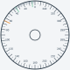

# ts2 ESP32 dual-core ignition ECU

This project is a PlatformIO-based ESP32 application for a real-time engine ignition controller with a separate logger/diagnostic core. The design deliberately keeps the timing-critical engine functions on Core 0 and moves low-priority telemetry, config handling, and diagnostics onto Core 1 so the ignition loop remains deterministic.

## System goals

- measure trigger-wheel timing on a 36:1 wheel
- detect a missing-tooth reference and calibrate its offset from TDC
- compute RPM using edge-to-edge timing
- schedule ignition events using a safe integer-based advance model
- provide a configurable map for a minimum advance and a mapped RPM-based advance curve
- produce a compact binary telemetry stream for logger-side diagnostics
- expose a hardware-timed debug strobe for visual timing checks against a degree-wheel reference

## Architecture

- Core 0: real-time ignition, trigger capture, spark scheduling, dwell output, strobe timing
- Core 1: serial logger, config receive, low-rate telemetry publishing

This split intentionally avoids sending serial data or doing heavy processing inside the time-critical edge path.

## Current features

### Trigger and RPM handling

- trigger input on GPIO 35 with interrupt-based edge capture
- 35-edge wheel convention with one missing-tooth reference gap
- period measurement using microsecond timestamps
- RPM estimation from the measured tooth period
- detection threshold for the missing-tooth event based on a gap larger than normal tooth spacing

### Timing and advance model

- integer-based timing math in tenths of a degree and microseconds
- low-RPM minimum advance fallback at 5.0° BTDC
- monotonic RPM-based advance lookup table
- interpolation across the advance curve for smoother timing
- configurable minimum and maximum advance values in the logger config packet
- fixed calibrated delay before ignition output, representing CDI/coil delay

### Spark generation

- ignition output on GPIO 4
- fixed dwell pulse for the coil/CDI trigger
- scheduled spark event computed from current RPM and missing-tooth offset
- safe fallback timing for cranking and low-RPM operation

### Logger and config protocol

- compact binary message format rather than text-based serial traffic
- config packet: version, missing-tooth offset, min/max advance, CDI delay, dwell, strobe settings
- telemetry packet: time, RPM, advance, crank angle, flags
- checksum validation on inbound and outbound frames
- message exchange kept narrow and efficient to avoid adding jitter to the ignition loop

### Debug strobe

- debug output on GPIO 25
- hardware-timed pulse using ESP32 `esp_timer`, not a blocking software delay
- default enabled state for bench validation
- configurable markers:
  - TDC
  - missing tooth
  - current advance
- pulse width configurable in milliseconds/microseconds terms, with a safe default of 5 ms

## Timing model and reference wheel

The project uses a conceptual degree wheel as a calibration aid. The SVG shown below is used to visualise the wheel geometry, missing-tooth reference, and the advance window from the safe minimum to the maximum tuned advance.



This wheel is intentionally set up to keep the visual timing convention clear:

- 0° is at the top of the wheel
- the labels run anti-clockwise for the timing reference
- the missing-tooth marker and TDC reference are shown distinctly
- the advance arc spans the calibrated window from low to high advance

## Project structure

- platformio.ini - PlatformIO project configuration for ESP32
- src/main.cpp - real-time ECU logic, binary protocol, timing math, strobe handling, and dual-core task split
- tests/test_timing_harness.py - host-side timing and protocol validation
- docs/timing-wheel.svg - timing wheel reference diagram

## Build and run

From the project root:

```bash
pio run
pio device monitor
```

## Safety and engineering notes

- Core 0 remains the hard real-time path and should not be burdened with WiFi/Bluetooth stacks or serial logging traffic.
- The strobe is a debug aid and should be used during setup and calibration rather than as a normal operating output.
- The missing-tooth offset is a calibrated engine parameter and must be confirmed on the actual hardware setup.
- The advance table is intentionally conservative and should be tuned against real engine data, not assumed final.

## Current status

This project is now at the point where it can:

- measure trigger timing
- estimate RPM and crank angle
- schedule ignition using a calibrated advance map
- communicate compact configuration and telemetry over a binary protocol
- flash a debug strobe for visual wheel verification

The next practical phase is live bench validation of the trigger-wheel offset, spark timing, and advance map against the real engine.
